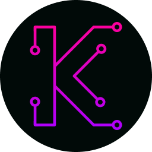

<h2>Content</h2>
<ul>
  <li><a href="#stack">Stack</a></li>
  <li><a href="#about-project">About Project</a></li>
  <li><a href="#random-backgrounds">Random Generated Backgrounds</a></li>
  <li><a href="#random-paths">Random Paths</a></li>
  <li><a href="#matrix-text">Matrix Text</a></li>
  <li><a href="#personal-experience">Personal Experience</a></li>
</ul>

<h1 id="stack">Stack</h1>
<ul>
  <li>React</li>
  <li>TypeScript</li>
  <li>SCSS</li>
  <li><a href="https://github.com/mattboldt/typed.js">Typed.js</a></li>
  <li><a href="https://github.com/7PH/powerglitch">PowerGlitch</a></li>
</ul>

<h1 id="about-project">About Project</h1>

  <a href="https://kamilas.netlify.app/">Preview</a>

  The website design was also done by me:  
  <a href="https://www.figma.com/design/r72NRYPErKgT8mdMwLLscI/Portfolio?node-id=1596-16&t=vQTl0RV4q06wEjWo-1">Figma Design</a>

  This project among classic UI features a custom-built <strong>Tech Stack board/canvas</strong> and <strong>randomly generated backgrounds</strong>. Most of the implementation does not strictly follow React programming patterns.  
  I chose PowerGlitch with vanilla JS instead of React, as it better suited the effects I wanted to achieve.

  Some components are heavily commented or overexplained. Many were first-time implementations, so the comments mainly serve as notes for my future self.

<h2 id="random-backgrounds">Random Generated Backgrounds</h2>

Both are based on the same canvas engine file to keep repeating logic in one place.  
They can be included in any React & TypeScript project easily (for now i don't plan to extract them to custom library). Below is a breakdown of customization for each background. They are mobile friendly with builded in size adjustments based on viewport size

<h3 id="random-paths">Random Paths</h3>

Random snaked paths simulating a printed circuit board.

<h4>Necessary Properties</h4>
<pre><code class="language-js">
baseInterval,
animationDuration,
pathSegments,
strokeColor,
strokeWidth,
zIndex,
freeze,
</code></pre>

<ul>
  <li><strong>baseInterval</strong> – Interval between path spawns.</li>
  <li><strong>animationDuration</strong> – Full lifecycle duration of a path (draw + erase).</li>
  <li><strong>pathSegments</strong> – Number of directional turns per path; higher values produce more complex shapes.</li>
  <li><strong>strokeColor</strong> – Color of the paths.</li>
  <li><strong>strokeWidth</strong> – Width of the paths.</li>
  <li><strong>zIndex</strong> – Canvas layering order.</li>
  <li><strong>freeze</strong> – Stops simulation time while keeping the RAF loop active.</li>
</ul>

<h4>Optional Properties</h4>
<pre><code class="language-js">
maxActive,
lengthsAmp = { min: 0.04, max: 0.16 },
advancedConfig = {
  targetFrameBudget: 2,
  avgFrameMsAlpha: 0.08,
  drawEveryNThresholds: [20, 30],
  drawEveryNValues: [1, 2, 3],
  spawnMultiplierValues: [1, 1.5, 2]
},
</code></pre>

<ul>
  <li><strong>maxActive</strong> – Maximum simultaneous active paths (real max also limited by interval/duration).</li>
  <li><strong>lengthsAmp</strong> – Relative segment length range (percentage of canvas size).</li>
  <li><strong>advancedConfig</strong> – Performance tuning:
    <ul>
      <li><strong>targetFrameBudget</strong> – Ideal frame time in ms for adaptive throttling.</li>
      <li><strong>avgFrameMsAlpha</strong> – Smoothing factor for exponential frame time averaging.</li>
      <li><strong>drawEveryNThresholds</strong> – Frame thresholds triggering performance tiers.</li>
      <li><strong>drawEveryNValues</strong> – Frame skipping values per tier.</li>
      <li><strong>spawnMultiplierValues</strong> – Spawn rate multipliers per tier.</li>
    </ul>
  </li>
</ul>

<h3 id="matrix-text">Matrix Text</h3>

Classic falling Matrix-style text with some custom tweaks.

<h4>Necessary Properties</h4>
<pre><code class="language-js">
baseInterval,
baseFontSize,
speedRange,
fillColor,
charSet,
zIndex,
freeze,
</code></pre>

<ul>
  <li><strong>baseInterval</strong> – Interval between new column spawns.</li>
  <li><strong>baseFontSize</strong> – Base font size for characters.</li>
  <li><strong>speedRange</strong> – Min/max speed of falling columns.</li>
  <li><strong>fillColor</strong> – Color of the characters.</li>
  <li><strong>charSet</strong> – Array of characters used.</li>
  <li><strong>zIndex</strong> – Canvas layering order.</li>
  <li><strong>freeze</strong> – Stops simulation time while keeping RAF loop active.</li>
</ul>

<h4>Optional Properties</h4>
<pre><code class="language-js">
fontSizeAmp = { min, max },
mutateInterval,
mutateChancePercent,
sizeAmps = { length, maxColumns },
advancedConfig = {
  targetFrameBudget: 2,
  avgFrameMsAlpha: 0.08,
  drawEveryNThresholds: [20, 30],
  drawEveryNValues: [1, 2, 3],
  spawnMultiplierValues: [1, 1.5, 2]
},
</code></pre>

<ul>
  <li><strong>fontSizeAmp</strong> – Multiplier range for font size.</li>
  <li><strong>mutateInterval</strong> – Interval in ms for changing characters in a column.</li>
  <li><strong>mutateChancePercent</strong> – Chance (%) that a character mutates on update.</li>
  <li><strong>sizeAmps</strong> – Size modifiers:
    <ul>
      <li><strong>length</strong> – Column length multiplier.</li>
      <li><strong>maxColumns</strong> – Maximum number of columns (scaled by screen width in code).</li>
    </ul>
  </li>
  <li><strong>advancedConfig</strong> – Performance tuning:
    <ul>
      <li><strong>targetFrameBudget</strong> – Ideal frame time in ms for adaptive throttling.</li>
      <li><strong>avgFrameMsAlpha</strong> – Smoothing factor for exponential frame time averaging.</li>
      <li><strong>drawEveryNThresholds</strong> – Frame thresholds triggering performance tiers.</li>
      <li><strong>drawEveryNValues</strong> – Frame skipping values per tier.</li>
      <li><strong>spawnMultiplierValues</strong> – Spawn rate multipliers per tier.</li>
    </ul>
  </li>
</ul>

<h1 id="personal-experience">Personal Experience During Rebuild</h1>

  Rebuilding this portfolio from an older version took longer than expected. I often fell into the trap of seeing "10 more ways to improve" after a single change, making it hard to decide when something was "good enough."  
  Keeping design and code in sync throughout the playground was challenging, but I managed to make it work.

  What started as a quick revamp evolved into a <strong>code playground</strong> where I experimented with new ideas and learned a lot. While it consumed more time than anticipated, it was a valuable learning experience.

